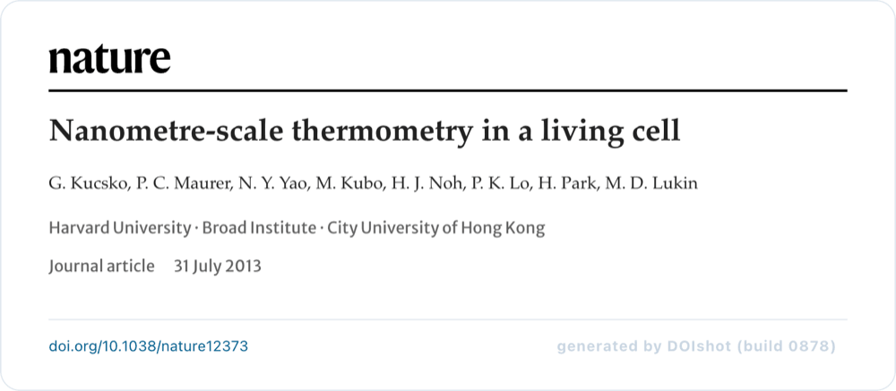
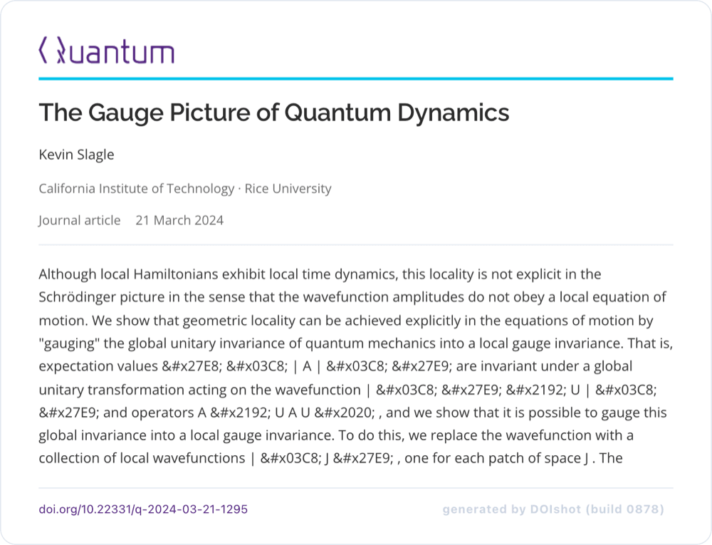
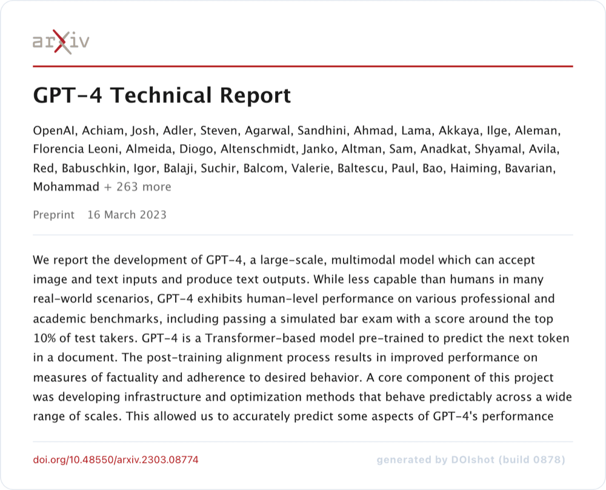
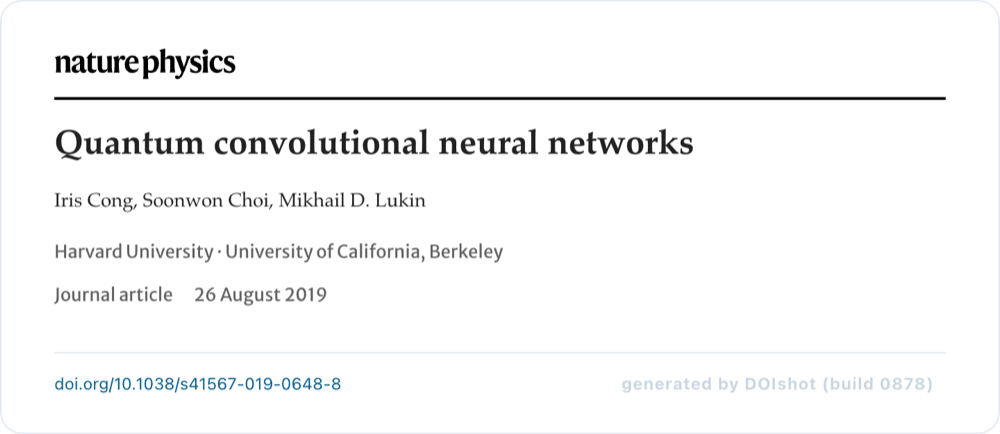

# DOIshot

**Turn any DOI into a beautiful, shareable paper snapshot.**

Paste a DOI -> get a clean card with title, authors, source-aware styling, and
abstract -> export it as a PNG or copy a citation / BibTeX / link.

<p align="center">
  <a href="#examples">
    
  </a>
  <br>
  <sub><i>A shot of <a href="https://francoismarieleregent.xyz/doishot/?doi=10.1038/nature12373">10.1038/nature12373</a> — see <a href="#examples">more examples</a>.</i></sub>
</p>

Licensed under [MIT](LICENSE).

**A live instance runs at [francoismarieleregent.xyz/doishot](https://francoismarieleregent.xyz/doishot).**
This repo is open source so you can read the code, run it yourself, and
contribute (e.g. add branding for a journal you care about). See
[Contributing](#contributing) below.

It's a **single static page**, no build step and no backend. DOIs are resolved
entirely in the browser via:

- **Crossref REST API** (`api.crossref.org`) - journals, conference papers, books…
- **DataCite REST API** (`api.datacite.org`) - fallback for arXiv, datasets, software…
- **OpenAlex** (`api.openalex.org`) - abstract enrichment when the publisher
  didn't deposit one with Crossref (common for APS journals, Nature, …).

All three support CORS, so everything runs client-side.

## Examples

Real shots exported from DOIshot (click a card to open it live). These are the
same DOIs offered as one-click examples in the app.

<table>
  <tr>
    <td width="50%">
      <a href="https://francoismarieleregent.xyz/doishot/?doi=10.1126/science.1259855"></a>
      <sub><b>Science</b> · <code>10.1126/science.1259855</code></sub>
    </td>
    <td width="50%">
      <a href="https://francoismarieleregent.xyz/doishot/?doi=10.1103/PhysRevX.8.031022"></a>
      <sub><b>PRX (APS)</b> · <code>10.1103/PhysRevX.8.031022</code></sub>
    </td>
  </tr>
  <tr>
    <td width="50%">
      <a href="https://francoismarieleregent.xyz/doishot/?doi=10.22331/q-2024-03-21-1295"></a>
      <sub><b>Quantum</b> · <code>10.22331/q-2024-03-21-1295</code></sub>
    </td>
    <td width="50%">
      <a href="https://francoismarieleregent.xyz/doishot/?doi=10.48550/arXiv.2303.08774"></a>
      <sub><b>arXiv</b> · <code>10.48550/arXiv.2303.08774</code></sub>
    </td>
  </tr>
  <tr>
    <td width="50%">
      <a href="https://francoismarieleregent.xyz/doishot/?doi=10.1038/s41567-019-0648-8"></a>
      <sub><b>Nature Physics</b> · <code>10.1038/s41567-019-0648-8</code></sub>
    </td>
    <td width="50%">
      <a href="https://francoismarieleregent.xyz/doishot/?doi=10.1038/nature12373"></a>
      <sub><b>Nature</b> · <code>10.1038/nature12373</code></sub>
    </td>
  </tr>
</table>

Each card carries the journal's own wordmark, fonts, and palette — see
[Journal branding](#journal-branding) for how that works.

## Run locally

No dependencies, just serve the folder over HTTP:

```sh
python3 -m http.server 8765
# open http://localhost:8765
```

Any static file server works (`npx serve`, `php -S`, etc.). Opening
`index.html` directly via `file://` won't work because the app fetches from the
resolver APIs.

## Files

```
index.html              # markup
style.css               # styling (the card is what gets exported) + @font-face
app.js                  # DOI parsing, resolution, journal theming, rendering, exports
assets/journals/        # official journal logos (trademarks; nominative use)
vendor/html-to-image.js # PNG export (vendored, no runtime CDN dependency)
```

### Vendored dependencies

| File                      | Package                                                  | Version | SHA-256                                                            |
| ------------------------- | -------------------------------------------------------- | ------- | ------------------------------------------------------------------ |
| `vendor/html-to-image.js` | [html-to-image](https://github.com/bubkoo/html-to-image) | 1.11.11 | `0181b9a4ea3351540751b2e72b6baecb5c2297093fcb0bd2af94fc531cb0fbda` |

See the header comment in each vendored file for update instructions.

## Journal branding

Cards for major venues reproduce the journal's real identity - official
wordmark/logo, the fonts the journal actually serves, and colors sampled from
each site's live stylesheet (extracted 2026-07):

| Venue                                        | Logo                                   | Fonts                                                                                          | Colors                                |
| -------------------------------------------- | -------------------------------------- | ---------------------------------------------------------------------------------------------- | ------------------------------------- |
| Nature / Nature Physics (any 10.1038)        | official wordmark SVGs from nature.com | Palatino serif stack + Merriweather Sans meta (_Harding is proprietary and not redistributed_) | link blue `#025e8d`, meta `#626262`   |
| APS: PRX, PRA, PRX Quantum, PRL, … (10.1103) | APS logo SVG + journal name            | Noto Sans (what journals.aps.org uses)                                                         | APS blue `#00538b`, ink `#2e2f35`     |
| Quantum (10.22331)                           | quantum-journal.org logo               | Raleway 600 headings + Open Sans                                                               | purple `#53257f`, cyan rule `#03c4eb` |
| arXiv (10.48550)                             | official arxiv.org logo SVG            | Lucida Grande system stack (arXiv serves no webfont)                                           | arXiv red `#b31b1b`                   |
| Science (10.1126)                            | official AAAS wordmark (Wikimedia)     | Source Serif 4 + Libre Franklin (_approximation_ - science.org hard-blocks non-browser access) | Science red `#c8102e`                 |

Everything else falls back to the colored-badge look (PNAS, ACS, RSC, IOP,
Optica, Springer, Elsevier, Wiley, IEEE keep tuned palettes).

Journal logos are included for nominative identification on snapshot cards.
They remain trademarks of their respective publishers.

## Appearance controls

Under the field toggles, per shot:

- **Style** - Journal (branded) or Minimal (neutral badge card)
- **Font size** - 75-145 % scale of the whole card
- **Width** - 560-1000 px card width
- **Ratio** - Auto height, or fixed 16:9 / 4:3 / 1:1 / 4:5
- **Export** - 1x / 2x / 3x PNG pixel density

## Deep links

- `…/?doi=10.1038/nature12373` - query form (works under any base path)
- `…/doi/10.1038/nature12373` - pretty form (redirected to the query form)

## Analytics & privacy

The hosted instance records which DOIs are looked up, and when, to see which
venues are popular. Each successful lookup sends a single anonymous row: the
DOI, the resolver source (`crossref` / `datacite`), and a surface tag. No
cookies, no IP storage, no personal data, and no third-party trackers. Raw
events are deleted after 90 days.

When you run the app locally, tracking is off unless you configure it yourself.

## Contributing

Contributions are welcome. Open an issue or pull request on GitHub.

The most common contribution is **adding or improving journal branding** for
venues that still use the generic colored-badge look. Branded cards need:

1. An official logo under `assets/journals/<name>/` (SVG preferred; nominative
   use only)
2. A new entry in `JOURNAL_THEME_RULES` in `app.js` (match on DOI prefix
   and/or journal title from Crossref)
3. Colors and fonts sampled from the journal's site (Google Fonts when the
   real typefaces are not redistributable)

For lighter-touch additions, a badge-style palette and font pairing in
`app.js` is often enough - no logo required.

Test with a real DOI via the local server above before opening a PR. Bug
fixes, export tweaks, accessibility, and docs are welcome too.
